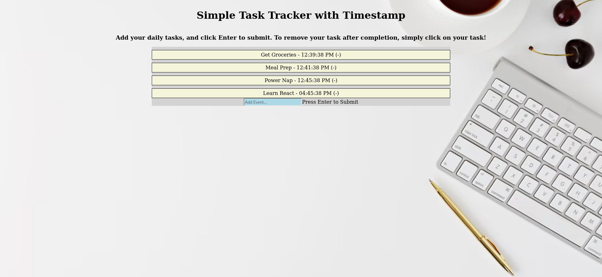

<h1 align="center">ToDo List Planner</h1>
This is a cool list planner that anyone can use to keep track of tasks and time. In the field, you can add an event and click enter to record that event and the timestamp.
When the curosr hovers over an event, that event becomes red. Click once to remove that event! 

## Links

- [Repo](<https://github.com/naderhassan001/To-Do-List-Planner> "<project-name> Repo")

- [Live](<http://todolistplanner.s3-website-us-east-1.amazonaws.com/> "Live View")

## Screenshots

## Options for Running the Program 

In the project directory, you have a few options.

You can open the index.html file in a web browser or with the extention "liver server" in VsCode or your favorite editor. 

## Built With

- JavaScript
- HTML
- CSS

## Future Updates

- [ ] I am going to add code to create a separate area where cleared to do items are placed. 
## Author

**Nader Hassan**

- [Profile](https://github.com/naderhassan001 "Nader Hassan")
- [Email](mailto:nader.hassan001@gmail.com "Hi!")

## 🤝 Support

Contributions, issues, and feature requests are welcome!

Give a ⭐️ if you like this project!
